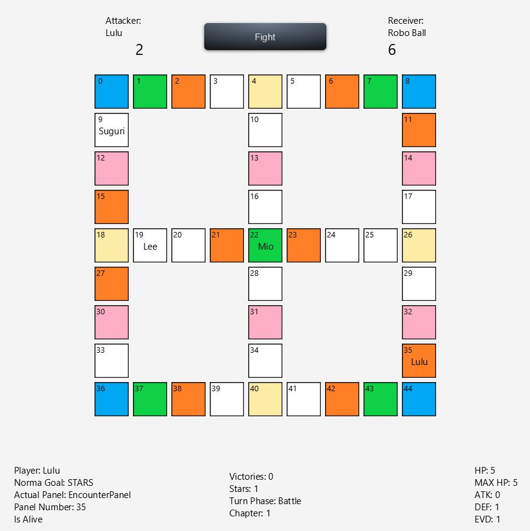
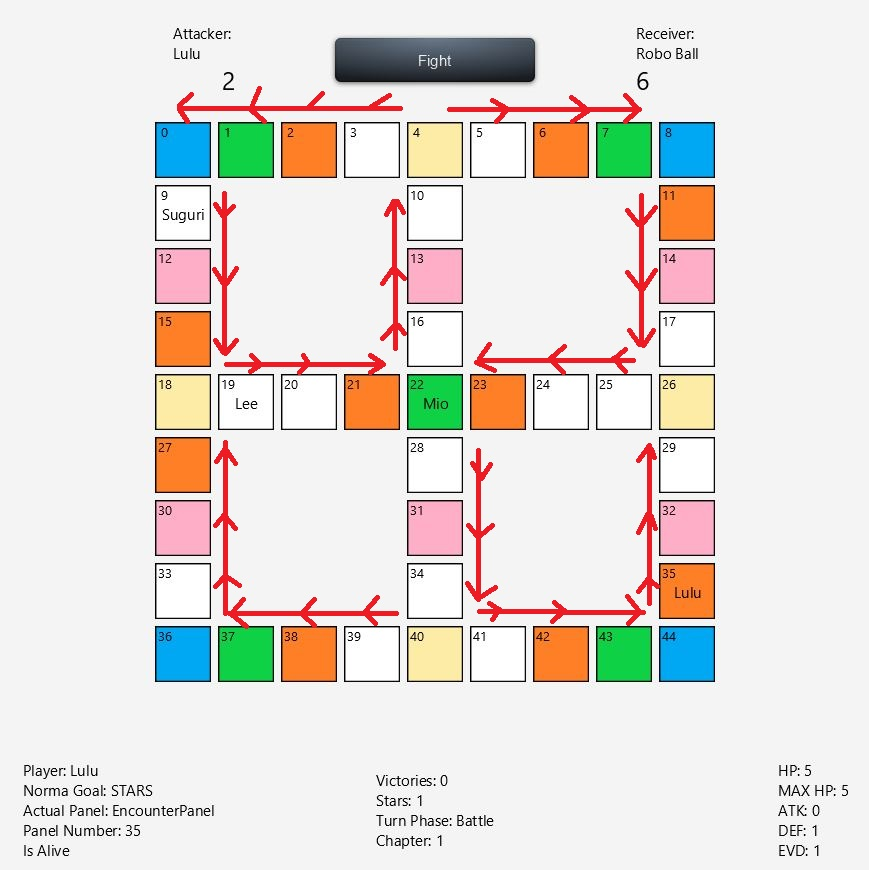

<!-- 1.0.3-b1 -->
# 99.7% Citric Liquid

Base code for CC3002's *99.7% Citric Juice* Project.

The project consists in creating a (simplified) clone of the game **100% Orange Juice**
developed by [Orange_Juice](http://daidai.moo.jp) and distributed by 
[Fruitbat Factory](https://fruitbatfactory.com).

The principal class to control the game is the gameController class.
The principal methods are:

    
    void setGameGUI(GameGUI gameGUI);
    GameGUI getGameGUI();
    void setGameState(GameState gameState);
    TurnController getTurnController();
    Panel createBonusPanel();
    Panel createBossPanel();
    Panel createDropPanel();
    Panel createEncounterPanel();
    Panel createNeutralPanel();
    Panel createHomePanel();
    List<Panel> getPanels();
    void setNextPanel(Panel origin,Panel target);
    void setNextPanel(Panel origin,Panel... targets);
    List<Player> getPlayers();
    List<BossUnit> getBosses();
    List<WildUnit> getWilds();
    Panel getPlayerPanel(Player player);
    Player createPlayer(String name,int hitPoints,int attack,int defense,int evasion)
    void setPlayerPanel(Player player, Panel panel);
    WildUnit createWildUnit(String name,int hitPoints,int attack,int defense,int evasion);
    BossUnit createBossUnit(String name,int hitPoints,int attack,int defense,int evasion);
    Player getTurnOwner();
    void setCurrPlayerNormaGoal(NormaGoal goal);
    void setPlayerHome(Player player, Panel homePanel);
    int getChapter();
    void endTurn();
    Player getWinner();
    void newGame();
    void changeGameStateEvent(GameState gameState);
    GameState getGameState();
    
Also to control the game flow in a turn you must use the turnController.
You can access with the gameController with gameController.getTurnController().
The principal methods in the turnController are:

    TypeCombat getTypeCombat();
    void setTypeCombat(TypeCombat typeCombat);
    boolean getPassedWaitHomePhase();
    void setPassedWaitHomePhase(boolean passedWaitHomePhase);
    void addPassedWaitPathPanel(Panel aPanel);
    boolean containsPassedWaitPathPanel(Panel aPanel);
    void addPassedWaitFightPanel(Panel aPanel);
    boolean containsPassedWaitFightPanel(Panel aPanel);
    void moveChoiceEvent(PhaseState phaseState);
    void setDice(int dice);
    int getDice();
    setPhaseState(PhaseState aPhaseState);
    PhaseState getState();
    Player getTurnOwner();
    int getChapter();
    void startTurn();
    void move();
    void roll();
    void continueMovement();
    void moveDecision();
    void endTurnDecision();
    int changePlayerPathDecision(int i)
    void fightDecision();
    int changeFightDecision(int i);
    void attack();
    void rollAtkAttack();
    void rollDefAttack();
    void selectTypeCombat(TypeCombat typeCombat);
    void rollAtkContraAttack();
    void rollDefContraAttack();
    void contraAttack();
    void endBattle();
    void rollRecovery();
    GameController getGameController();

To manage the gameGUI you must know the GameGUI class and use 
the GameScene class. For every state of the game and the phase of 
the turn (GameState and PhaseState respectively) is made a specific 
GameScene.

For example for the RecoveryPhaseState there is the RecoveryPhaseScene.

In the gameGUI class the setUp() method creates all the necessary items to the
environment to test the game. In the same method yo can strategy change the comments
to test all game features, like the NormaClear, Battles and more (path choice, home choice and fight choice 
at the same time another is example). To do it change in the code

        //Change this lines
        gameController.setPlayerPanel(suguri,gameController.getPanels().get(4)); //10
        gameController.setPlayerPanel(lee,gameController.getPanels().get(18)); //4
        gameController.setPlayerPanel(mio,gameController.getPanels().get(26));
        gameController.setPlayerPanel(lulu,gameController.getPanels().get(40));

        //suguri.increaseStarsBy(15);
        
To:

        //Change this lines
        gameController.setPlayerPanel(suguri,gameController.getPanels().get(10)); //10
        gameController.setPlayerPanel(lee,gameController.getPanels().get(4)); //4
        gameController.setPlayerPanel(mio,gameController.getPanels().get(26));
        gameController.setPlayerPanel(lulu,gameController.getPanels().get(40));

        suguri.increaseStarsBy(15);
        
Here is a screenshot of the game.

The map has a defined route with path options.

